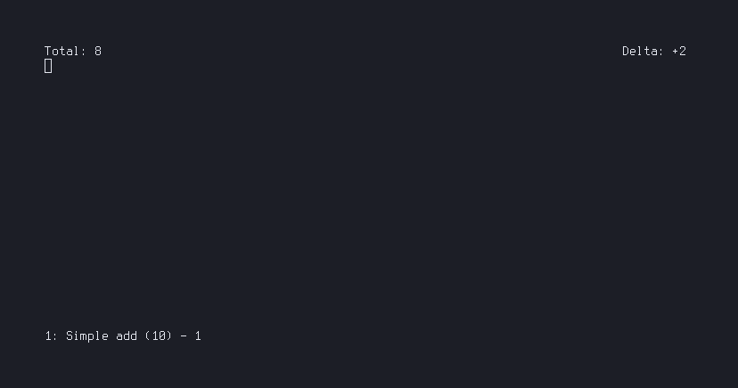

# cluster

## What is this?

This is Cluster, concatenated from clicker and rust. It is a training project for me, to learn Rust.

The general idea of this game is, to push the counter higher and higher, by clicking yourself and buying upgrades. It is supposed to be played in the terminal.

For now it is not very advanced, because it is written by an absolute Rust beginner, who learns everything on the way, by reading the official Rust book, reading documentation, looking at other peoples code, applying concepts he knows from other languages and looking for solutions.

Talking about pull requests, I am aware of the small chance that someone will see this and willing to contribute(^^), but I am open for any contribution.

## State of this project

I am currently working on this, if I find time and motivation. It is here for me to learn, so I will work on this when I want to.

## Currently implemented features

Not much unfortunalty^^

* clicking to manually increase the counter
* basic idea of a shop
  * currently one item implemented
  * click a button, it will purchase the item and the `add`-function increases the multiplier
  * so like the infrastructure is there
* prints current points, delta of points, shop with amount of each item and price
* saving and loading

## Planned features

### "frontend"

* [x] save and load progress
* [ ] more variety in the shop

### "backend"

* [x] fix enormous input lag
* [ ] display shop programatically
* [x] document everything with Rust

## Conclusion

I will update this README on the go, while I progress through this game. I will try to fix every problem listed here and like I said, every contribution is welcome. Maybe you are a Rust beginner and want to learn, do not hesitate.
